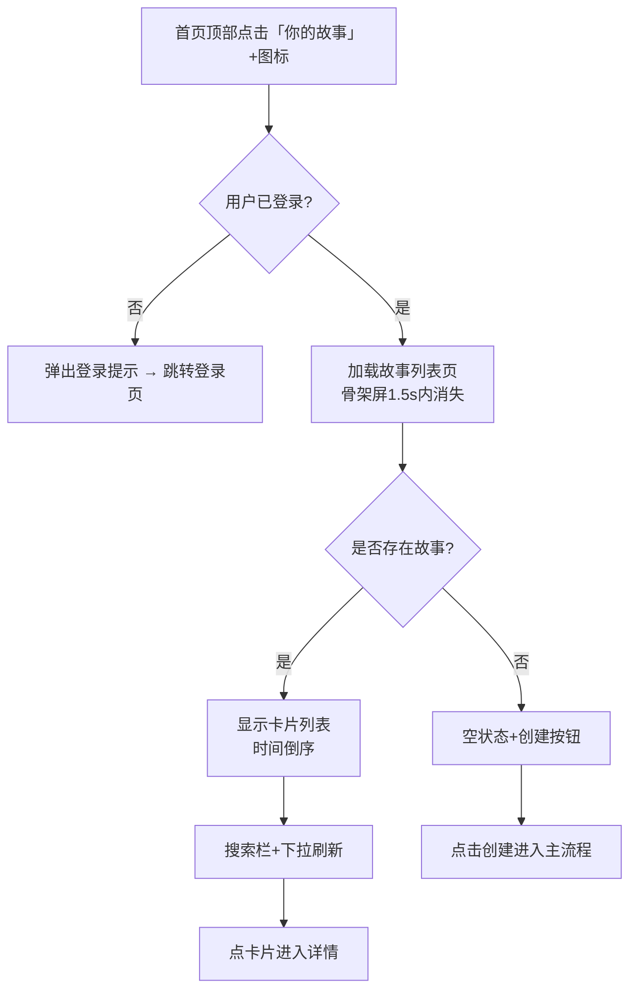
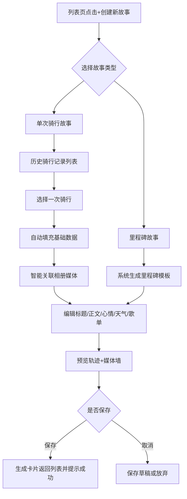
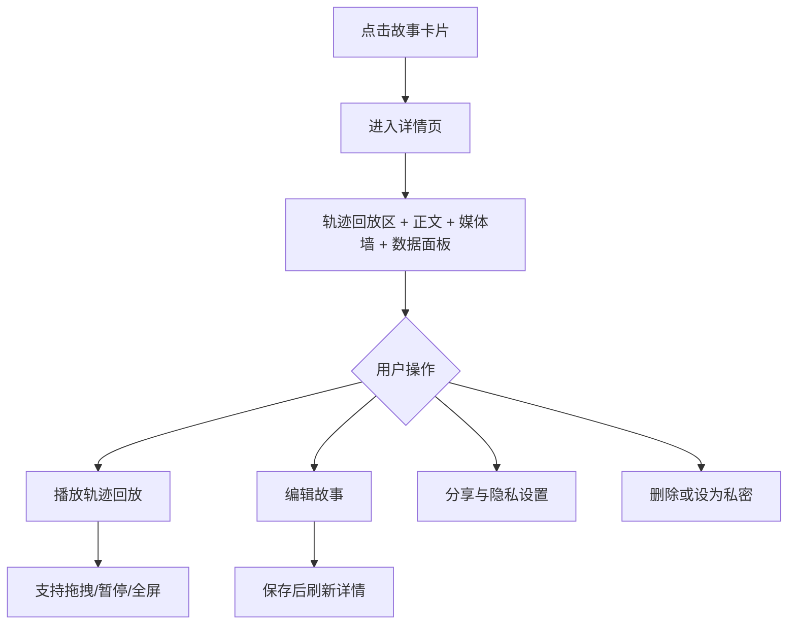
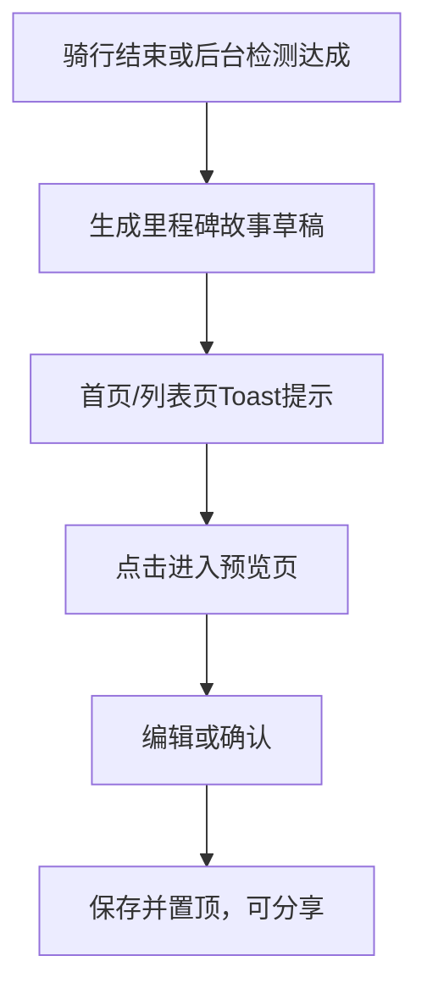

# 「你的故事」模块产品需求文档（PRD）

**文档版本**：1.0  
**更新日期**：2026-03-06  
**适用端**：微信小程序（iOS / Android）  
**关联模块**：首页、骑行记录、社区、个人中心、相册与媒体、通知中心

---

## 1. 模块概述

**模块名称**：你的故事  
**模块定位**：个人骑行经历的情感化沉淀与叙事中心，将量化骑行数据转化为可阅读、可回放、可分享的成长故事。  
**入口位置**：首页顶部圆形图标区第一个（带“+”符号）。  
**目标用户**：所有骑行用户，重点覆盖中高频骑行记录用户与内容分享用户。  
**核心价值**：
- 让“骑行数据”变成“生活叙事”，提升长期留存与情感连接
- 提升首页入口点击率、故事创建率与分享率
- 强化用户对个人成长与阶段成就的感知

---

## 2. 目标与范围

**业务目标**
- 提升骑行后内容沉淀率（记录完成后转化为故事）
- 提升故事分享传播率与社区互动率
- 建立“里程碑自动生成”能力，形成产品主动激励机制

**MVP 范围（首版必做）**
- P0：故事列表与创建入口、单次骑行故事创建
- P1：自动生成里程碑故事
- P2：隐私与分享控制（基础版）

---

## 3. 用户场景

- **场景A：骑行后快速沉淀**  
  用户结束骑行后，进入“你的故事”，从最近骑行一键生成故事草稿，补充文字和心情后保存。
- **场景B：里程碑时刻记录**  
  用户首次达成 50km 或累计 1000km 时，系统自动弹出里程碑故事模板，用户编辑后发布。
- **场景C：回看与复盘**  
  用户按时间、心情、里程筛选故事，回看当日轨迹、照片和感悟。

---

## 4. 功能需求清单

| 优先级 | 功能点 | 详细描述 | 验收标准 |
|---|---|---|---|
| P0 | 故事列表与创建入口 | 显示用户已创建故事，按时间倒序；支持“+创建新故事” | 首屏加载 < 2s；支持下拉刷新；空状态引导明确 |
| P0 | 单次骑行故事创建 | 从历史骑行选择一次记录，自动带入日期/里程/时长/轨迹/卡路里；补充文本、心情、媒体 | 支持最近骑行与历史筛选；保存成功后列表实时更新 |
| P1 | 自动生成里程碑故事 | 检测里程碑，自动生成可编辑模板并提醒用户 | 触发准确；模板含数据亮点与鼓励文案；支持分享 |
| P1 | 轨迹+媒体自动关联回放 | 详情页支持轨迹播放，沿时间轴浮现照片/视频 | 回放流畅；支持暂停、拖拽、继续 |
| P1 | 心情与非量化记录 | 支持天气、温度、心情、歌单、遇见的人与感悟 | 字段可选填；心情标签可快速选择 |
| P2 | AI 辅助创作 | 输入关键词后生成故事初稿（语气可选） | 生成合规内容；支持中英双语；可编辑 |
| P2 | 故事模板库 | 提供至少10种模板并支持收藏 | 模板可预览、可套用、可收藏 |
| P2 | 隐私与分享控制 | 单篇故事可设置可见范围；支持导出图片/视频/PDF | 默认仅自己可见；分享支持水印 |
| P2 | 年度/周期回顾 | 自动汇总周期故事与数据图表，支持导出 | 支持手动触发；包含趋势图与总结语 |
| P3 | 搜索与标签过滤 | 支持关键词、时间、心情、里程组合过滤 | 搜索响应 < 1s；多条件可组合 |

---

## 5. 非功能需求

- **性能**
  - 列表首屏 < 1.5s，完整加载 < 2s
  - 详情页轨迹回放帧率 ≥ 30fps
- **兼容性**
  - iOS 14+ / Android 8+，适配刘海屏与挖孔屏
- **安全**
  - 默认加密存储，敏感分享二次确认
  - 支持导出与删除，符合可撤回原则
- **无障碍**
  - 支持语音朗读与高对比模式
- **离线**
  - 已保存故事可离线查看
  - 创建过程支持离线草稿

---

## 6. 交互流程图（Mermaid）

## 6.1 入口流程（进入故事列表）

## 6.2 创建新故事主流程

## 6.3 详情查看与编辑流程

## 6.4 里程碑自动生成流程

---

## 7. 页面与内容规范

**列表页卡片**
- 日期、标题、首图/轨迹缩略图、里程摘要、心情标签
- 支持左右滑动快捷操作（编辑、删除、设私密）

**详情页布局**
- 顶部：动态轨迹回放区（建议占屏 45%~50%）
- 中部：正文+心情字段+天气与歌单
- 底部：媒体墙+数据面板+分享操作

**视觉与动效**
- 主色沿用青绿渐变体系
- 创建成功使用轻庆祝动效，避免夸张闪烁
- 回放动画优先 transform/opacity，避免卡顿

---

## 8. 验收口径

- 功能验收：按优先级逐项通过
- 性能验收：弱网环境下列表、详情、保存流程可用
- 体验验收：空状态、异常态、离线态均有明确反馈
- 安全验收：隐私默认最小暴露、分享需用户明确确认

---

## 9. 里程碑与排期建议

- **MVP（2~3个迭代）**
  - 迭代1：列表/创建/详情基础能力
  - 迭代2：里程碑自动生成 + 隐私分享
  - 迭代3：回放优化 + 搜索过滤
- **增强版**
  - AI 辅助创作、模板库、年度回顾

