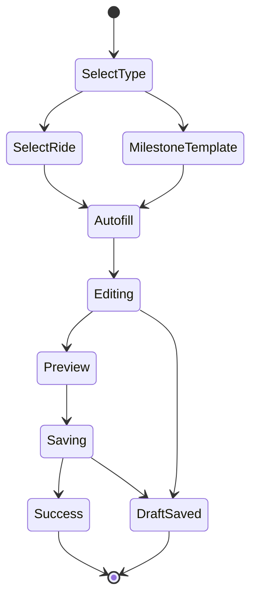

# 「你的故事」模块开发文档

**文档版本**：1.0  
**更新日期**：2026-03-06  
**对应PRD**：你的故事-PRD.md  
**开发目标**：将需求拆解为可实现的前后端方案、数据模型、接口契约、状态管理与测试规范。

---

## 1. 技术架构与边界

## 1.1 端侧（微信小程序）
- 首页入口：`miniprogram/pages/home`（点击“你的故事”）
- 列表页：新增 `miniprogram/pages/story-list`
- 创建页：`miniprogram/pages/story-create`（已有，可扩展）
- 编辑页：`miniprogram/pages/story-edit`（已有，可扩展）
- 详情页：`miniprogram/pages/story-viewer`（已有，可扩展）

## 1.2 服务端（Next.js API）
- API 承载：`src/app/api/*`
- 建议新增：
  - `GET/POST /api/stories`
  - `GET/PATCH/DELETE /api/stories/:id`
  - `POST /api/stories/:id/share`
  - `POST /api/stories/milestone/generate`
  - `GET /api/stories/search`

## 1.3 存储层（Prisma）
- 主库：`prisma/schema.prisma`
- 建议新增 Story、StoryMedia、StoryMilestone、StoryDraft 模型

---

## 2. 数据模型设计

## 2.1 Story（故事主表）

| 字段 | 类型 | 说明 |
|---|---|---|
| id | String (uuid) | 主键 |
| userId | String | 用户ID |
| rideId | String? | 关联骑行记录ID |
| title | String | 标题 |
| content | String | 正文 |
| mood | String? | 心情标签 |
| moodNote | String? | 心情文字 |
| weather | String? | 天气 |
| temperature | Int? | 温度 |
| playlist | String? | 歌单文本 |
| reflection | String? | 感悟 |
| visibility | Enum | PRIVATE / FRIENDS / PUBLIC |
| type | Enum | RIDE / MILESTONE / YEAR_REVIEW |
| coverUrl | String? | 封面 |
| routeSnapshot | Json? | 轨迹快照 |
| stats | Json | 里程/时长/卡路里 |
| status | Enum | DRAFT / PUBLISHED / ARCHIVED |
| createdAt | DateTime | 创建时间 |
| updatedAt | DateTime | 更新时间 |

## 2.2 StoryMedia（故事媒体）

| 字段 | 类型 | 说明 |
|---|---|---|
| id | String | 主键 |
| storyId | String | 故事ID |
| type | Enum | IMAGE / VIDEO |
| url | String | 媒体地址 |
| shotAt | DateTime? | 拍摄时间 |
| lat | Float? | 纬度 |
| lng | Float? | 经度 |
| timelineSec | Int? | 回放时间轴位置 |

## 2.3 StoryMilestone（里程碑）

| 字段 | 类型 | 说明 |
|---|---|---|
| id | String | 主键 |
| userId | String | 用户ID |
| ruleCode | String | 规则编码（FIRST_50KM等） |
| triggeredAt | DateTime | 触发时间 |
| payload | Json | 触发数据快照 |
| storyId | String? | 关联故事 |
| disabled | Boolean | 用户是否关闭该触发 |

## 2.4 StoryDraft（离线/云草稿）

| 字段 | 类型 | 说明 |
|---|---|---|
| id | String | 主键 |
| userId | String | 用户ID |
| draftType | Enum | CREATE / EDIT |
| payload | Json | 草稿内容 |
| syncStatus | Enum | LOCAL_ONLY / SYNCED / CONFLICT |
| updatedAt | DateTime | 更新时间 |

---

## 3. API 设计（契约）

## 3.1 故事列表
- `GET /api/stories?page=1&pageSize=20&keyword=&mood=&from=&to=&distanceMin=&distanceMax=`
- 返回：
  - `items[]`（卡片数据）
  - `nextCursor` 或 `total`

## 3.2 创建故事
- `POST /api/stories`
- 入参：`rideId | milestonePayload | title | content | mood... | medias[] | visibility`
- 返回：`storyId`、`createdAt`

## 3.3 更新故事
- `PATCH /api/stories/:id`
- 支持局部更新（标题、正文、媒体、隐私等）

## 3.4 删除故事
- `DELETE /api/stories/:id`
- 逻辑删除，支持回收站保留7天（建议）

## 3.5 里程碑生成
- `POST /api/stories/milestone/generate`
- 入参：`userId`（服务端拉取最近骑行和累计统计）
- 返回：可编辑模板草稿

## 3.6 分享导出
- `POST /api/stories/:id/share`
- 入参：`format=IMAGE|VIDEO|PDF`、`withWatermark=true`
- 返回：导出链接

---

## 4. 前端页面与组件拆分

## 4.1 页面结构
- `story-list`
  - 搜索栏
  - 筛选栏（时间/心情/里程）
  - 故事卡片流
  - 空状态与创建引导
- `story-create`
  - 骑行选择器
  - 自动填充数据区
  - 编辑器区（标题/正文/心情/天气/歌单）
  - 媒体选择与预览
  - 轨迹预览
- `story-viewer`
  - 顶部轨迹回放播放器
  - 正文区
  - 媒体墙
  - 数据面板
  - 分享与隐私操作

## 4.2 复用组件建议
- `StoryCard`
- `StoryEditorForm`
- `StoryMediaWall`
- `StoryPrivacySheet`
- `StoryMilestoneBanner`
- `StoryPlaybackPlayer`

---

## 5. 状态管理与流程控制

## 5.1 页面状态
- `loading`
- `empty`
- `ready`
- `submitting`
- `offline-draft`
- `error`

## 5.2 创建流程状态机（建议）

---

## 6. 里程碑规则引擎（建议）

## 6.1 规则表示
- 规则表字段：`ruleCode`、`conditionExpr`、`templateId`、`enabled`
- 示例：
  - `FIRST_50KM`: `singleRideDistance >= 50 && firstTime`
  - `TOTAL_1000KM`: `totalDistance >= 1000 && previously < 1000`
  - `CLIMB_500M`: `singleRideElevationGain >= 500`

## 6.2 触发时机
- 主要触发点：骑行结束后（record保存成功后）
- 补偿任务：每日定时扫描，避免漏触发

---

## 7. 性能与体验落地

- 列表首屏：骨架屏 + 分页 + 图片懒加载
- 轨迹回放：优先 Canvas/Map 原生能力，避免频繁 setData 大对象
- 媒体加载：缩略图优先，详情再拉原图
- 动画：统一 transform/opacity，避免布局抖动
- 搜索：前端300ms防抖 + 后端索引查询

---

## 8. 安全、隐私与合规

- 默认隐私级别：`PRIVATE`
- 分享前二次确认（展示可见范围与水印说明）
- 故事删除支持“软删除+可恢复”
- 导出文件默认添加 App 标识与日期水印
- 个人媒体读取仅在用户授权后进行

---

## 9. 测试计划（QA）

## 9.1 功能测试
- 创建/编辑/删除/搜索/筛选/分享全链路
- 里程碑触发准确性
- 离线草稿保存与恢复

## 9.2 性能测试
- 列表首屏 < 1.5s
- 搜索响应 < 1s
- 详情回放帧率 ≥ 30fps

## 9.3 兼容测试
- iOS / Android 主流机型
- 刘海屏 / 挖孔屏 / 高分辨率设备
- 深色模式和高对比模式

## 9.4 异常测试
- 无网络、弱网、超时重试
- 相册权限拒绝、定位权限拒绝
- 上传中断与断点恢复

---

## 10. 迭代拆分建议

- **Iteration 1（MVP）**
  - 列表 + 创建 + 详情基础 + 隐私基础
- **Iteration 2**
  - 里程碑自动生成 + 导出分享 + 搜索过滤
- **Iteration 3**
  - 轨迹媒体回放增强 + AI 辅助 + 模板库
- **Iteration 4**
  - 年度回顾故事集 + 图表优化 + 国际化

---

## 11. 与现有代码对接点

- 首页入口点击处理：`home.js` 的 `onStoryTap`（需区分“我的故事入口”与“好友故事查看”）
- 已有页面复用：`story-create`、`story-edit`、`story-viewer`（建议统一字段协议）
- API 访问统一走 `miniprogram/utils/api.js`，避免页面内散落请求

